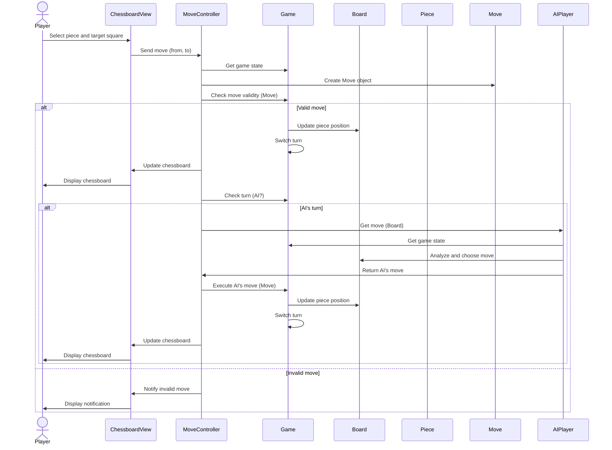

<!-- ```mermaid
sequenceDiagram
    actor Player
    participant NewGameScreen
    participant NewGameController
    participant Game
    participant Board
    participant AIPlayer

    Player->>NewGameScreen: Select "New Game"
    NewGameScreen->>NewGameController: Send options (difficulty level)
    NewGameController->>Game: Create a new Game
    NewGameController->>Board: Initialize the game board
    NewGameController->>AIPlayer: Create AIPlayer with selected difficulty
    NewGameController->>Game: Set up players (Player, AIPlayer, Board)
    NewGameController->>NewGameScreen: Display initial game board
    NewGameScreen->>Player: Display game board
``` -->



<!-- ```mermaid
graph TD
    Administrator --o ManageUsers
    Administrator --o ManageGames
    Administrator --o ManageTraining
    Administrator --o ConfigureSystem

    subgraph graph ManageUsers
        direction LR
        ManageUsers --o CreateUser
        ManageUsers --o EditUser
        ManageUsers --o DeleteUser
    end

    subgraph graph ManageGames
        direction LR
        ManageGames --o ViewHistory
        ManageGames --o DeleteGame
    end

    subgraph graph ManageTraining
        direction LR
        ManageTraining --o AddContent
        ManageTraining --o EditContent
        ManageTraining --o DeleteContent
    end

    subgraph graph ConfigureSystem
        direction LR
        ConfigureSystem --o SetAIDifficulty
        ConfigureSystem --o EditRules
    end
```

```mermaid
graph TD
    Player --o StartNewGame
    Player --o MakeMove
    Player --o ViewHistory
    ViewHistory --o SelectGame
    SelectGame --o AnalyzeGame
    Player --o SaveGame
    Player --o LoadGame
    Player --o AdjustSettings
    Player --o AccessLearning
``` -->


<!-- 
```mermaid
classDiagram
  direction LR

  class Game {
    -board : Board
    -playerWhite : HumanPlayer
    -playerBlack : Player
    -currentPlayer : Player
    -movesHistory : List<Move>
    -status : ACTIVE | BLACK_WIN | WHITE_WIN | DRAW
    +startGame()
    +makeMove(Move move)
    +isGameOver(): boolean
    +switchTurn()
    +getCurrentPlayer(): Player
  }

  class Board {
    -squares : Spot[7][7]
    +getSpot(int x, int y): Spot
    +placePiece(Piece piece, Spot spot)
    +isValidCoordinate(int x, int y): boolean
  }

  class Spot {
    -x : int
    -y : int
    -piece : Piece
    +getX(): int
    +getY(): int
    +getPiece(): Piece
    +setPiece(Piece piece)
    +isEmpty(): boolean
  }

  class Move {
    -player : Player
    -start : Spot
    -end : Spot
    -pieceMoved : Piece
    -pieceCaptured : Piece
    +getPlayer(): Player
    +getStart(): Spot
    +getEnd(): Spot
    +getPieceMoved(): Piece
    +getPieceCaptured(): Piece
  }

  class Piece {
    -color : WHITE | BLACK
    -isKilled : boolean
    +getColor(): Color
    +isKilled(): boolean
    +isValidMove(Board board, Spot start, Spot end): boolean
  }

  class Player {
    -color : WHITE | BLACK
    +getColor(): Color
  }

  class Pawn extends Piece {
    +isValidMove(Board board, Spot start, Spot end): boolean
  }
  class Knight extends Piece {
    +isValidMove(Board board, Spot start, Spot end): boolean
  }
  class Bishop extends Piece {
    +isValidMove(Board board, Spot start, Spot end): boolean
  }
  class Rook extends Piece {
    +isValidMove(Board board, Spot start, Spot end): boolean
  }
  class Queen extends Piece {
    +isValidMove(Board board, Spot start, Spot end): boolean
  }
  class King extends Piece {
    +isValidMove(Board board, Spot start, Spot end): boolean
    +isInCheck(Board board): boolean
  }

  class HumanPlayer extends Player {
    -username : string
    +getUsername(): string
    +makeMove(Game game): Move
  }
  class AIPlayer extends Player {
    -difficultyLevel : BEGINNER | INTERMEDIATE | ADVANCED
    +getDifficultyLevel(): Difficulty
    +makeMove(Game game): Move
  }

  Game "1" --o "1" Board : uses
  Board "1" --o "*" Spot : contains
  Spot "1" --o "0..1" Piece : has
  Game "1" --o "*" Move : has moves
  Move "1" --o "1" Player : made by
  Move "1" --o "1" Spot : from
  Move "1" --o "1" Spot : to
  Move "1" --o "1" Piece : moved
  Move "1" --o "0..1" Piece : captured
  Game "1" --o "2" Player : has players

  Piece <|-- Pawn
  Piece <|-- Knight
  Piece <|-- Bishop
  Piece <|-- Rook
  Piece <|-- Queen
  Piece <|-- King
  Player <|-- HumanPlayer
  Player <|-- AIPlayer
```
```mermaid
graph LR
    User --o UserInterface
    UserInterface --o ChessEngine
    ChessEngine --o AI
    ChessEngine --o DataStore
    AI --o DataStore
``` -->
https://docs.google.com/document/d/12OVODDkT4I-SmtKSCkVbABbcKwAR9WpSJXQUtwZgHnA/edit?usp=sharing

Công việc: Tìm hiểu đề tài	
Nội dung cần hoàn thành: - Tính cấp thiết của đề tài - Mục tiêu của đề tài - Giới hạn và phạm vi của đề tài - Nội dung thực hiện - Phương pháp tiếp cận
Công việc: Trình bày cơ sở lý thuyết	
Nội dung cần hoàn thành: - Phương pháp phát triển phần mềm hướng đối tượng - Các công nghệ dùng để thực hiện cài đặt đề tài
Công việc: Khảo sát và xác định yêu cầu người dùng	
Nội dung cần hoàn thành: Khảo sát nghiệp vụ, yêu cầu và phân tích yêu cầu của bài toán
Công việc: Đặc tả yêu cầu phần mềm	
Nội dung cần hoàn thành: - Các yêu cầu chức năng - Các yêu cầu phi chức năng - Biểu đồ lớp thực thể